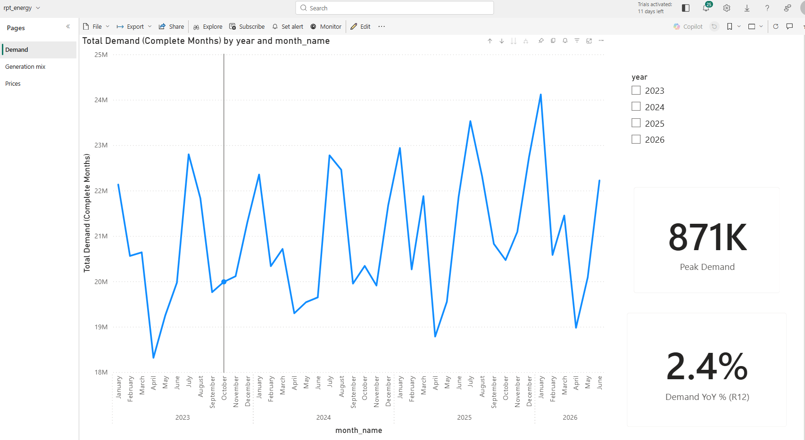
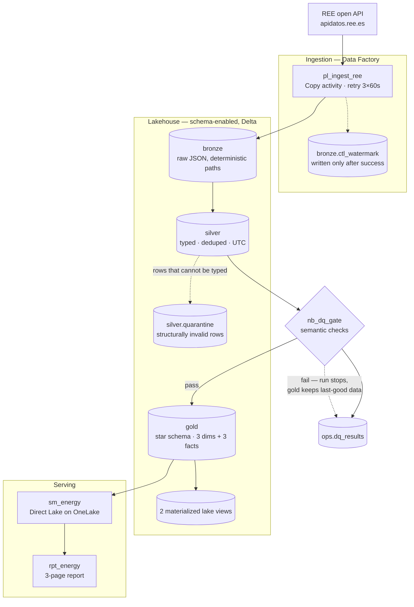

# fabric-energy-lakehouse

A production-shaped batch lakehouse on **Microsoft Fabric** over the Spanish electricity
market — daily demand, generation mix by technology, and market prices from
[REE's open API](https://apidatos.ree.es), landed, typed, quality-gated and served through a
Direct Lake semantic model.


**Status: `v1.0.0` — deployed to a production workspace and verified end to end.**



---

## What this demonstrates

Most "data platform" portfolio projects stop at *a pipeline that runs*. This one is built to
the standard a working team would actually hold it to, and the interesting content is in the
constraints:

- **Ingestion that is safe to re-run.** Incremental *and* idempotent are treated as two
  separate problems with two separate mechanisms — proven with a kill-test.
- **Data quality with two jurisdictions.** Structurally broken rows are quarantined and the
  run continues; semantically invalid rows fail the run. The gate writes every result before
  it raises.
- **Logic that is tested, not eyeballed.** All parsing and DQ rules live in a typed,
  `mypy --strict`, unit-tested Python package. Notebooks stay thin orchestration.
- **A release path that is real.** The production workspace is never Git-bound and never
  hand-edited; it is built exclusively by `fabric-cicd` from `main`, with per-environment
  parameterization.
- **Decisions written down with their rejected alternatives** — including the ones that
  turned out wrong, corrected rather than quietly overwritten.

Every claim above is backed by a build journal, screenshots, and SQL proofs in [`docs/`](docs/).

## Architecture



`pl_daily_refresh` chains the whole medallion from a single daily trigger — ingest → three
silver notebooks → DQ gate → gold rebuild → MLV refresh — with one failure alert routed off
the terminal activity and a `Fail` activity to re-assert a red status.

## The data

| Layer | Contents |
|---|---|
| Bronze | Raw JSON:API responses, one file per indicator per month, deterministic paths |
| Silver | 3 typed Delta tables (daily demand, daily generation by technology, hourly prices) + quarantine |
| Gold | `dim_date`, `dim_technology`, `dim_indicator` · `fact_demand_daily`, `fact_generation_daily`, `fact_price_hourly` |
| Semantic | `sm_energy` — Direct Lake on OneLake, 4 natural-key relationships, **11 DAX measures** |

History runs from **2023-01** to present (~3.5 years), refreshed daily.

## Engineering notes

Full reasoning for all nineteen decisions is in **[`docs/decisions.md`](docs/decisions.md)**.
The ones worth reading first:

### Incremental ≠ idempotent

A watermark decides *what to fetch*. A deterministic path plus Copy-overwrite decides *what
happens if you fetch it twice*. Conflating them produces a guarantee that evaporates exactly
when you need it — on the failed run, where the watermark never moved. The kill-test proves
the split: a cancelled backfill re-ran to a byte-identical file set with the watermark
untouched, and `pl_backfill_ree` never reads the watermark at all.

### Structural quarantine vs semantic gate

A `null` where a number is required and a demand value of `-4200` are different failures. The
first *cannot become a typed row without guessing* — quarantine it, keep going. The second
parses fine and only a **policy** can judge it — fail the run. The gate writes all results to
`ops.dq_results` before raising, so every failure is diagnosable from a table rather than from
the first line of stderr.

In practice it caught 8 real negative-generation rows — all coal, all legitimate thermal
self-consumption — which is why the bound is renewable-aware rather than a blanket `>= 0`.

### Materialized lake views — where they earn their keep, and where they don't

Gold carries two MLVs alongside the notebook-built star schema, deliberately using both
mechanisms side by side. An MLV wins when the aggregate is **stable, relational, and
maintenance-free by design**: one `CREATE MATERIALIZED LAKE VIEW`, and the engine owns
refresh, lineage and storage. It's the wrong tool when the logic outgrows a single `SELECT`
(the star build needs a generated calendar and wheel-imported metadata), when refresh must be
sequenced inside a DQ-gated pipeline rather than run on the engine's cadence, or when the
definition churns — changing an MLV is `DROP` + `CREATE`, not an idempotent edit.

**Rule applied here:** facts and dims are built imperatively (testable, gate-sequenced);
last-mile aggregates a BI page reads are declared as MLVs. They require a schema-enabled
lakehouse — chosen irreversibly at creation for exactly this payoff.

### Direct Lake on OneLake, and no calculated columns

The semantic model reads Delta straight from OneLake: no import refresh, no SQL-endpoint
metadata lag, and — decisively — **no DirectQuery fallback path exists at all**, so "no
fallback" is satisfied by construction rather than by a toggle. The trade-off is that Direct
Lake supports no calculated columns, so every derived column is built in Spark. Shape it in
the lake, not in the model.

### Two mechanisms pointing in opposite directions

The most common misconception about Fabric source control is that Git integration *is* the
deployment mechanism. It isn't:

> **Git integration** = dev workspace ⇄ `develop`. Bidirectional, manual, interactive — for
> **authoring**.
> **`fabric-cicd`** = `main` → prod workspace. One-way, scripted, gated — for **releasing**.
>
> **The prod workspace is never Git-bound and never hand-edited.**

Binding prod to `main` and clicking *Update all* looks equivalent and isn't, for four
independent reasons — any one disqualifying:

1. **No parameterization.** Git integration copies definitions verbatim, and Fabric bakes
   dev-tenant GUIDs into items whether you like it or not. Pulled into prod, they still
   address **dev's** objects. [`fabric/parameter.yml`](fabric/parameter.yml) is the seam that
   rewrites them.
2. **It isn't CI/CD.** It's a person clicking a button — no trigger, no gate, no run log.
3. **It makes prod writable.** A Git-bound workspace has a Source control panel, so prod can
   be hand-edited and committed *back* to `main`.
4. **Wrong identity.** A release should deploy as a service principal, not as whoever is
   logged in.

## What shipping it actually taught

Two defects survived code review and were found only by running the release into production.
Both are documented rather than quietly patched, because the failure modes generalize:

- **`__pycache__` broke the first deploy.** `fabric-cicd` publishes from the **filesystem**,
  not from git, POSTing every file in an item's folder as a definition part. Gitignored
  bytecode — invisible to `git status`, absent from the repo — shipped as a notebook part and
  the API rejected it. *"Not in git" does not mean "won't deploy."*
- **The semantic model silently kept its dev binding.** Direct Lake on OneLake stores its
  source as a Power Query expression holding a literal `onelake.dfs.../<workspace>/<lakehouse>`
  URL, which `fabric-cicd`'s auto-re-pointing cannot reach into. Production rendered
  **dev's data, looking perfectly healthy**, until the binding itself was read.

The second is the more useful lesson. Every verification step that passed — all items present,
notebook bindings correct, pipeline sink correct, report renders — is a check that can only
fail *loudly*. **None of them could detect a wrong-but-valid target.** Verification
thoroughness isn't how many checks pass; it's whether any of them could have failed for the
reason you actually care about.

## Repo layout

| Path | Contents |
|---|---|
| `src/energy_lakehouse/` | Typed, Spark-free parsers and DQ checks — shipped as a wheel into a Fabric Environment |
| `tests/` | 26 pytest tests over real captured REE fixtures |
| `fabric/` | All 16 Fabric item definitions as code, plus `parameter.yml` |
| `scripts/deploy.py` | The dev → prod release command |
| `sql/proofs/` | SQL run against the lakehouse endpoint to verify the star schema independently |
| `docs/` | Decision log, capacity & cost notes, per-phase build journal, evidence pack |
| `.github/workflows/` | `deploy-prod.yml` — the release pipeline as code |

## Running it

Local checks (no Fabric needed — the package is deliberately Spark-free at import, so it
tests without a cluster):

```bash
uv sync
uv run ruff check . && uv run mypy src scripts && uv run pytest
```

Releasing to a Fabric workspace:

```bash
uv sync --group deploy
python scripts/deploy.py --environment prod
```

The script picks its authentication path automatically: a service principal when
`FABRIC_CLIENT_ID` / `FABRIC_CLIENT_SECRET` / `FABRIC_TENANT_ID` are set, otherwise an
interactive browser login.

### The service-principal path, and why it doesn't run here

[`.github/workflows/deploy-prod.yml`](.github/workflows/deploy-prod.yml) implements the
enterprise pattern — merge to `main` triggers a deploy as a service principal — and ships in
the repo, gated behind an `SPN_ENABLED` repository variable so it exists without firing.

It does not run on the tenant this was built on. The Microsoft Entra admin centre returns
**HTTP 401** for this account on both the Entra blade and the App-registrations deep link, so
the tenant has *"Restrict access to Microsoft Entra admin center"* enabled and app
registration is unreachable — not merely disabled. A knock-on worth stating precisely: the
Fabric *"Service principals can use Fabric APIs"* setting is therefore **unverifiable** here
rather than known-disabled, because reading it needs the same admin portal.

So prod is deployed by running that same script locally with an interactive login: same code,
same `parameter.yml`, same reviewed commit — only the identity and the trigger differ. The gap
is a tenant policy, not an architectural one, and it is documented rather than papered over.

## Documentation

| Document | What's in it |
|---|---|
| [`docs/decisions.md`](docs/decisions.md) | 19 architectural decisions, each with its rejected alternative |
| [`docs/capacity-notes.md`](docs/capacity-notes.md) | CU smoothing, measured run costs, and an honest SKU-sizing argument |
| [`docs/data-dictionary.md`](docs/data-dictionary.md) | Column-level contracts for every silver and gold table |
| [`docs/phases/`](docs/phases/) | The step-by-step build journal — reproducible, including the deviations |
| [`docs/evidence/`](docs/evidence/) | Screenshots proving each phase, catalogued per phase |

## Roadmap

- **Real-Time Intelligence extension** — Eventstream → Eventhouse/KQL → Activator alerting,
  as a streaming counterpart to this batch platform.
- **Second Git provider** — the same phases rebuilt on native GitHub integration with a
  working service-principal CI/CD path, to contrast the two providers directly.

## Author

**Gonzalo López Crespo** — [LinkedIn](https://linkedin.com/in/gonzalolopezcrespo) ·
[GitHub](https://github.com/gonzalonao)

## License

[MIT](LICENSE)
